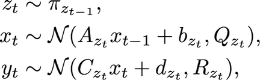
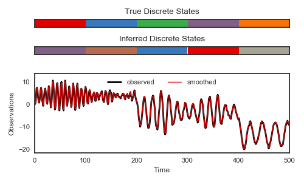

# PySLDS: Bayesian inference for switching linear dynamical systems
_Authors: Matt Johnson and Scott Linderman_

This package combines [pyhsmm](https://github.com/mattjj/pyhsmm)
and [pylds](https://github.com/mattjj/pylds) to provide simple
interfaces for learning and inference in switching linear dynamical
systems. We support inference via Gibbs sampling,
structured mean field, and expectation maximization (EM) for
dynamical systems with linear Gaussian state dynamics and
either linear Gaussian or count observations. Count data can be
handled via Pólya-gamma augmentation of the data. 
These inference algorithms all benefit from the fast message passing
code developed in PyLDS.

```
git clone git@github.com:mattjj/pyslds.git
cd pyslds
pip install -e .
```

# Background Switching linear dynamical systems (SLDS) are powerful
models for approximating nonlinear dynamical systems. The basic idea
is to model the data, `y_t`, as a linear projection of a
low-dimensional latent state, `x_t`. Moreover, these continuous latent
states co-evolve alongside a discrete latent state, `z_t`.  The
instantaneous discrete state indexes into a set of linear dynamics
parameters. That is, in order to propagate the continuous state forward
one time step, we first sample the next discrete state, then we use
the linear dynamics associated with that discrete state to update the
continuous state. This is summarized with the following dynamics equations:

<p align="center">

</p>

Here, `A_k`, `Q_k`, `C_k`, and `R_k` are matrices associated 
with discrete state `z_t = k`, and `b_k` and `d_k` are vector
biases associated with these states.  While the dynamics are 
conditionally linear given the discrete latent state, the composition
of many linear systems is highly nonlinear.

# Example
PySLDS exposes a variety of classes for working with linear
dynamical systems. For example, the following snippet will
generate synthetic data from a random model:
```python
import numpy.random as npr
from pyslds.models import DefaultSLDS

K = 5               # Number of discrete latent states
D_obs = 1           # Observed data dimension
D_latent = 2	    # Latent state dimension
D_input = 0	        # Exogenous input dimension
T = 2000  	        # Number of time steps to simulate

true_model = DefaultSLDS(K, D_obs, D_latent, D_input)
inputs = npr.randn(T, D_input)
y, x, z = true_model.generate(T, inputs=inputs)

# Compute the log likelihood of the data with the true params
true_ll = true_model.log_likelihood() 
```
The `DefaultSLDS` constructor initializes an SLDS with a
random walk dynamics. The outputs are `y`, a `T x D_obs` 
matrix of observations, and `x`, a `T x D_latent` matrix
of continuous latent states, and `z`, a length-`T` vector of integers
denoting the discrete latent states.

Now create another SLDS and try to infer the latent states and
learn the parameters given the observed data. 

```python
# Create a separate model and add the observed data
test_model = DefaultSLDS(K, D_obs, D_latent, D_input)
test_model.add_data(y)

# Run the Gibbs sampler
N_samples = 1000
def update(model):
    model.resample_model()
    return model.log_likelihood()

lls = [update(test_model) for _ in range(N_samples)]
```

We can plot the log likelihood over iterations to assess the
convergence of the sampling algorithm:

```python
# Plot the log likelihoods
plt.figure()
plt.plot([0, N_samples], true_ll * np.ones(2), '--k', label="true")
plt.plot(np.arange(N_samples), lls, color=colors[0], label="test")
plt.xlabel("iteration")
plt.ylabel("training likelihood")
plt.legend(loc="lower right")
```


We can also smooth the observations with the test model.
```python
# Smooth the data
smoothed_data = test_model.smooth(data, inputs)

plt.figure()
plt.plot(data, color=colors[0], lw=2, label="observed")
plt.plot(smoothed_data, color=colors[1], lw=1, label="smoothed")
plt.xlabel("Time")
plt.xlim(0, 500)
plt.ylabel("Smoothed Data")
plt.legend(loc="upper center", ncol=2)
```



This is based on the [simple demo](/examples/simple_demo.py) in the
the [examples](/examples) directory. Check out that folder for demos of other
types of inference, as well as examples of how to work with count
data and missing observations. 

# Installation
To install `pyslds` from source, first clone the repo

    git clone git@github.com:mattjj/pyslds.git
    cd pyslds

Then install in developer mode:

    pip install -e .

Or use the standard install:

    python setup.py install

